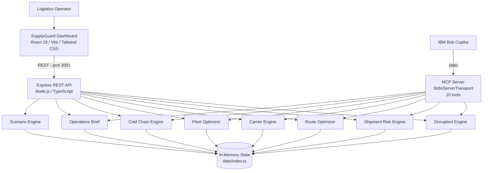

# SupplyGuard AI

**IBM Bob AI Innovation Hackathon 2026 — Track: AI**

> An intelligent logistics control tower for supply chain disruption management, fleet utilisation optimisation, and cold-chain monitoring.

---

## 👥 Team

| Field | Value |
|---|---|
| **Team Name** | Team Phoenix |
| **Track** | AI |
| **Team Lead** | [YOUR NAME — fill in before submission] |
| **Members** | 24CS034-Samarth, 24CS035-Sanidhya, 24CS038-Daksh, 24CS054-Krish |

---

## 🎯 Problem Statement

Logistics operations managers at mid-to-large enterprises manage disruptions manually across spreadsheets and email chains, with no unified view of which shipments are actually affected or how severely. 20–30% of fleet assets sit idle while critical shipments are delayed, and cold-chain temperature excursions are discovered after delivery — when cargo integrity is already lost and regulatory liability has already accrued. Supply chain disruptions cost Fortune 500 companies an average of $100M per year; global cold chain failures account for $35B in annual losses.

---

## 💡 Solution

SupplyGuard AI is an intelligent logistics control tower that correlates active disruptions with individual shipment routes to calculate live, explainable risk scores, then surfaces actionable recommendations for route changes, carrier swaps, fleet redeployments, and cold-chain interventions — all from a single unified interface. IBM Bob is a first-class integration via a 10-tool MCP server, so operators can query the full intelligence layer conversationally without touching the UI.

---

## ✨ Key Features

- **Disruption Impact Analysis:** Ingests 20 disruptions across 5 pre-built scenarios (port strike, weather, carrier failure, etc.); correlates each against shipment route segments to identify genuinely affected shipments — not just any shipment near the event.
- **Shipment Risk Scoring:** Composite 0–100 score per shipment, weighted across disruption overlap, carrier reliability, cargo value, and schedule urgency; score breakdown surfaced as human-readable labels (`DISRUPTION_OVERLAP`, `TIGHT_DEADLINE`, etc.).
- **Route & Carrier Recommendations:** Ranked alternative routes and carriers scored on cost delta, added transit days, reliability, and disruption exposure; top option auto-badged `RECOMMENDED`.
- **Fleet Utilisation Optimizer:** Identifies idle trucks, containers, and vessels from a 30-asset fleet; calculates cost-of-idle per day and ranks redeployment targets by proximity and benefit score.
- **Cold-Chain IoT Intelligence:** Processes 500+ synthetic sensor readings per shipment; detects excursion windows by duration × deviation; classifies severity as `MINOR` / `MAJOR` / `CRITICAL`; renders annotated time-series temperature charts.
- **IBM Bob MCP Copilot:** 10 MCP tools covering every intelligence engine; natural-language queries answered with live data (e.g., "Give me the top 5 actions I should take right now").
- **Operations Brief:** One-click AI-generated brief aggregating all active risks, priorities, and recommended actions with an overall supply chain health score.
- **Scenario Simulator:** 5 pre-built disruption scenarios activatable from the UI for demonstration and training purposes.

---

## 🛠️ Tech Stack

| Category | Technologies |
|---|---|
| **Languages** | TypeScript, JavaScript |
| **Frameworks** | React 18, Vite 5, Express 4, Tailwind CSS, Recharts |
| **IBM Technologies** | IBM Bob, Model Context Protocol (MCP) |
| **Testing** | Jest 29, ts-jest |
| **Other** | Lucide React, Zod, Axios, React Router, ts-node, @modelcontextprotocol/sdk |

---

## 📐 Architecture

SupplyGuard AI is a three-tier TypeScript monorepo. The React frontend calls the Express REST API; IBM Bob calls the same intelligence engines via the MCP server over stdio. Both paths share a single in-memory state module.



See [`docs/architecture.md`](docs/architecture.md) for the full component table, data flow walkthrough, security considerations, and scalability notes.

---

## 🤖 IBM Bob Integration

SupplyGuard ships an MCP server at `src/mcp/` built with `@modelcontextprotocol/sdk` and `StdioServerTransport`. Bob spawns it as a child process — no separate network port needed.

### 10 MCP Tools

| Tool | Purpose |
|---|---|
| `get_active_disruptions` | Active disruptions, filterable by severity |
| `get_affected_shipments` | Shipments impacted by disruptions with risk scores |
| `analyze_shipment_risk` | Deep risk breakdown for a specific shipment |
| `recommend_routes` | Ranked alternative routes for a shipment |
| `recommend_carriers` | Ranked alternative carriers for a shipment |
| `get_idle_fleet` | Idle fleet assets, filterable by type |
| `recommend_fleet_redeployment` | Redeployment recommendations for idle assets |
| `get_cold_chain_alerts` | Active temperature excursion alerts |
| `analyze_temperature_excursion` | Full time-series analysis for a cold-chain shipment |
| `generate_operations_brief` | Comprehensive current-state brief with priorities |

### Example Bob Prompts

- *"Give me the top 5 actions I should take right now"*
- *"Which shipments are most affected by active disruptions?"*
- *"Show me idle trucks that can be redeployed"*
- *"Which cold-chain shipments have temperature excursions?"*
- *"Why is SHP-003 flagged as critical?"*

### Connect Bob

Build the MCP server and add it to Bob's MCP config:

```bash
cd src/mcp && npm install && npm run build
```

```json
{
  "mcpServers": {
    "supplyguard": {
      "command": "node",
      "args": ["/absolute/path/to/bob-ai-hackathon-team-phoenix/src/mcp/dist/index.js"],
      "transport": "stdio"
    }
  }
}
```

---

## ⚡ How to Run

### Prerequisites
- Node.js 18+ (20 LTS recommended)
- npm 9+
- No paid APIs required

### Quick Start

```bash
# Backend (Terminal 1)
cd src/backend && npm install && npm run dev

# Frontend (Terminal 2)
cd src/frontend && npm install && npm run dev
```

Open **http://localhost:5173**

### MCP Server (IBM Bob)

```bash
cd src/mcp && npm install && npm run build
# Then configure Bob's MCP config — see docs/setup-guide.md
```

### Tests

```bash
cd src/tests && npm install && npm test
# Expected: 115 passed, 115 total
```

See [`docs/setup-guide.md`](docs/setup-guide.md) for the full setup guide including troubleshooting.

---

## 🖥️ Demo

| Artifact | Link |
|---|---|
| 📹 Demo Video | See [demo/demo-video-link.txt](demo/demo-video-link.txt) |
| 🌐 Live Demo | NOT DEPLOYED — run locally (see Quick Start above) |
| 🖼️ Screenshots | See [demo/screenshots/](demo/screenshots/) |
| 📊 Presentation | See [presentation/slides.md](presentation/slides.md) |

### Demo Scenarios

1. **Rotterdam Port Strike** — Activate to see disruption impact on European trade lanes
2. **Severe Weather Event** — Weather-driven route recommendations across the Pacific corridor
3. **Cold Chain Emergency** — Triggers temperature excursion alerts across refrigerated shipments
4. **Carrier Capacity Loss** — Forces carrier reallocation across affected shipments
5. **Combined Crisis** — All scenarios simultaneously; demonstrates operations brief under pressure

### Best Bob Prompts to Demo

- *"Give me the top 5 actions I should take right now"*
- *"Which shipments are most affected by active disruptions?"*
- *"Show me idle trucks that can be redeployed"*
- *"Which cold-chain shipments have temperature excursions?"*
- *"Why is [shipment ID] critical?"*

---

## 📁 Repository Structure

```
bob-ai-hackathon-team-phoenix/
├── src/
│   ├── backend/          — Express REST API (Node.js/TypeScript) — port 3001
│   ├── frontend/         — React dashboard (Vite/TypeScript/Tailwind) — port 5173
│   ├── intelligence/     — Business logic engines (pure TypeScript)
│   ├── mcp/              — IBM Bob MCP server (10 tools)
│   ├── data/             — Synthetic datasets and scenario definitions
│   ├── shared/           — Shared TypeScript types and interfaces
│   ├── tests/            — Jest test suite (115 tests, 9 suites)
│   └── .env.example      — Environment variable template
├── docs/
│   ├── problem-statement.md
│   ├── solution-overview.md
│   ├── architecture.md
│   └── setup-guide.md
├── demo/
│   ├── screenshots/
│   ├── demo-video-link.txt
│   └── live-demo-url.txt
├── presentation/
│   └── slides.md
└── submission.yaml
```

---

## ⚠️ Known Limitations

- Runs on synthetic demo data — not connected to live logistics APIs or IoT platforms
- Cold-chain severity thresholds are configurable demo rules requiring regulatory validation before production use
- No authentication or authorisation implemented
- MCP server requires a locally running IBM Bob instance
- Not tested on Safari (primary target: Chrome/Firefox/Edge)

---

## 🏅 What We're Most Proud Of

The IBM Bob MCP integration is genuinely load-bearing. Every intelligence engine — disruption analysis, shipment risk scoring, route optimisation, carrier recommendations, fleet redeployment, cold-chain excursion analysis, and the operations brief — is accessible as a real MCP tool calling actual application logic against live state. Bob is not a wrapper around hardcoded answers; it queries the same functions the REST API uses.

The cold-chain excursion engine is the other standout: it processes 500+ realistic IoT readings with a proper temporal analysis (duration × deviation), produces severity classifications that match how quality managers actually evaluate excursions, and renders the full time-series in the dashboard. The analysis is not hardcoded per shipment — every result is computed from the sensor data.

---
