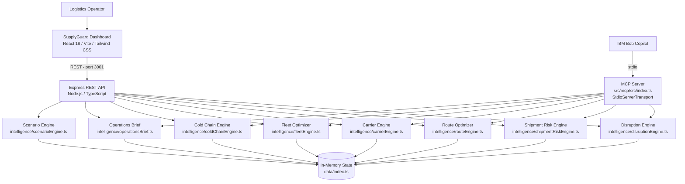

# Architecture

## System Architecture

SupplyGuard AI is a three-tier TypeScript monorepo. The frontend communicates exclusively with the Express REST API. IBM Bob communicates with the same intelligence engines through the MCP server over stdio transport. Both API and MCP server share the same in-memory application state module — there is one source of truth.

---

## Components

| Component | Technology | Responsibility | Path |
|---|---|---|---|
| **Dashboard** | React 18, Vite 5, TypeScript, Tailwind CSS, Recharts, Lucide React | Unified UI: KPI cards, disruption list, shipment table, route/carrier recommendations, fleet optimizer, cold-chain charts, Bob Copilot, scenario simulator, operations brief | `src/frontend/` |
| **REST API** | Express 4, Node.js, TypeScript, Zod | HTTP layer exposing all intelligence engines as JSON endpoints; validates request parameters; sets CORS; manages shared state mutations (scenario activation) | `src/backend/` |
| **Disruption Engine** | Pure TypeScript | Ingests 20 disruptions; filters by active state and severity; propagates scenario activations; returns affected route IDs | `src/intelligence/disruptionEngine.ts` |
| **Shipment Risk Engine** | Pure TypeScript | Scores 50 shipments 0–100 on 4 factors; returns per-factor labels; filters by risk tier | `src/intelligence/shipmentRiskEngine.ts` |
| **Route Optimizer** | Pure TypeScript | Compares current route vs. alternatives on cost delta, delay, disruption exposure, and carrier reliability; badges recommended option | `src/intelligence/routeEngine.ts` |
| **Carrier Engine** | Pure TypeScript | Ranks 10 carriers by on-time performance, cost, capacity, and disruption-lane overlap; returns recommendation reason | `src/intelligence/carrierEngine.ts` |
| **Fleet Optimizer** | Pure TypeScript | Identifies idle assets (30 fleet assets); calculates cost-of-idle per day; ranks redeployment targets by proximity and benefit score | `src/intelligence/fleetEngine.ts` |
| **Cold Chain Engine** | Pure TypeScript | Processes 500+ IoT readings; detects excursions by duration × deviation; classifies MINOR/MAJOR/CRITICAL; returns time-series data for charts | `src/intelligence/coldChainEngine.ts` |
| **Operations Brief** | Pure TypeScript | Aggregates outputs from all engines into a prioritised brief with health score, top actions, and summary statistics | `src/intelligence/operationsBrief.ts` |
| **Scenario Engine** | Pure TypeScript | Defines 5 pre-built disruption scenarios; activates/deactivates disruptions by mutating shared state | `src/intelligence/scenarioEngine.ts` |
| **MCP Server** | `@modelcontextprotocol/sdk`, StdioServerTransport, Zod | Exposes 10 tools to IBM Bob; validates tool arguments with Zod; calls the same intelligence engine functions as the REST API | `src/mcp/src/index.ts` |
| **Shared Types** | TypeScript interfaces | Common type definitions shared across backend, intelligence, and MCP layers | `src/shared/` |
| **Demo Data** | TypeScript modules | 50 shipments, 20 disruptions, 30 fleet assets, 10 carriers, 20 routes, 500+ IoT readings, 5 scenario definitions | `src/data/` |
| **Test Suite** | Jest 29, ts-jest | 115 tests across 9 suites covering all intelligence engines and the API layer | `src/tests/` |

---

## Data Flow

### Main Workflow (Operator Using Dashboard)

1. **Operator opens dashboard** at `http://localhost:5173`. Vite serves the React SPA.
2. **Dashboard fetches initial state**: `GET /api/disruptions`, `GET /api/shipments`, `GET /api/fleet`, `GET /api/cold-chain/alerts`. The Express API delegates each request to the corresponding intelligence engine.
3. **Intelligence engines query shared state** (`src/data/index.ts`) — a singleton module that holds the current in-memory arrays of disruptions, shipments, fleet assets, carriers, routes, and IoT readings.
4. **Operator activates a scenario** (e.g., Rotterdam Port Strike). The frontend calls `POST /api/scenarios/:id/activate`. The scenario engine mutates shared state, setting the affected disruptions to `active: true`.
5. **Dashboard re-fetches affected endpoints**. Risk scores are recalculated; affected shipments surface with elevated scores and disruption-overlap flags.
6. **Operator clicks a high-risk shipment**. Dashboard calls `GET /api/shipments/:id/risk` and `GET /api/shipments/:id/routes`. The risk engine returns the full score breakdown; the route engine returns ranked alternatives.
7. **Operator opens Fleet Optimizer**. `GET /api/fleet/idle` returns idle assets. Operator triggers a redeployment: `POST /api/fleet/:id/redeploy`.

### Cold-Chain Workflow

1. **Dashboard loads cold-chain page**: `GET /api/cold-chain/alerts`. The cold-chain engine scans IoT readings for any shipment with at least one out-of-range reading.
2. **Operator clicks an alert**. Dashboard calls `GET /api/cold-chain/:shipmentId/analysis`. The engine runs the full time-series analysis, calculating excursion windows, max deviation, cumulative out-of-range minutes, and final severity classification.
3. **Dashboard renders the temperature chart** using Recharts, with excursion events highlighted as reference areas on the time axis.

### IBM Bob MCP Workflow

1. **Operator types a natural-language query** into Bob Copilot (e.g., "Give me the top 5 actions I should take right now").
2. **Bob selects the `generate_operations_brief` tool** and calls the MCP server over stdio.
3. **MCP server validates the arguments** with Zod and calls `generateOperationsBrief()` from `intelligence/operationsBrief.ts`.
4. **Operations brief engine aggregates** disruption, shipment, fleet, and cold-chain state into a structured summary.
5. **MCP server serialises the result** as JSON content and returns it to Bob.
6. **Bob formats and presents** the brief in natural language to the operator.

---

## Security Considerations

- **No secrets required to run the demo.** The application operates entirely on synthetic in-memory data. No API keys are needed unless the optional IBM watsonx.ai integration is enabled.
- **Environment variables for optional credentials.** `WATSONX_API_KEY` and `WATSONX_PROJECT_ID` are read from `.env` (never committed; `.gitignore` enforces this).
- **CORS is scoped.** The Express backend sets `CORS_ORIGIN=http://localhost:5173` by default, rejecting cross-origin requests from any other origin.
- **MCP server uses stdio transport.** There is no network socket for the MCP server — it is spawned as a child process by Bob, eliminating the network attack surface entirely.
- **No authentication layer.** This is a demo prototype. Authentication and session management are explicitly excluded from scope and listed as known limitations.
- **Input validation with Zod.** All REST API request parameters and all MCP tool arguments are validated with Zod schemas before reaching the intelligence engines.

---

## Scalability Notes

SupplyGuard AI is a demo prototype designed to run locally. The architectural decisions that would matter in a production path:

- **Stateless intelligence engines.** All seven engine modules are pure functions over the state object. Replacing the in-memory state module with a database client (PostgreSQL, MongoDB) would not require changes to any engine — only the data layer.
- **Horizontal API scaling.** The Express backend holds no per-request state. Moving to a shared Redis store for the mutable state (active disruptions, scenario activations) would make the API tier horizontally scalable behind a load balancer.
- **IoT data volume.** The cold-chain engine currently processes all 500+ readings on every request. At production scale, pre-aggregated excursion windows stored in a time-series database (InfluxDB, TimescaleDB) would replace the full-scan approach.
- **MCP server concurrency.** The current MCP server is a single stdio process. For multi-operator production use, an HTTP-based MCP transport (SSE) with a process pool would support concurrent Bob sessions.
- **Real disruption feeds.** The disruption engine is designed to be fed from external sources. Replacing the static JSON array with a streaming feed from a maritime AIS provider, weather API, or news NLP pipeline would require changes only to `src/data/disruptions.ts`.
